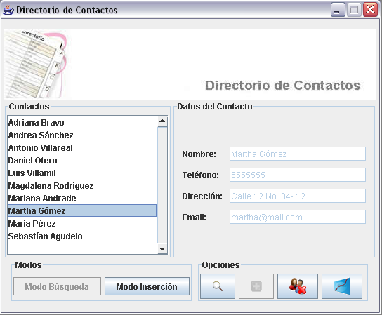
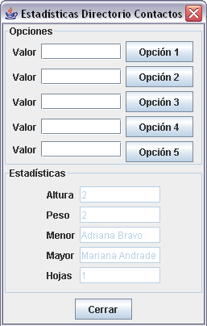

# Enunciado

Se quiere construir un directorio en el cual el usuario puede almacenar
la información de sus contactos. Un contacto tiene 4cuatro datos: un 
nombre (que sin importar mayúsculas o minúsculas debe ser único), un 
teléfono, una dirección postal y una dirección de correo electrónico. El 
directorio debe ofrecer al usuario las siguientes opciones:

1. Agregar un nuevo contacto dado (solo el nombre es obligatorio).
2. Localizar un contacto dado su nombre.
3. Desplegar la información de un contacto dado su nombre.
4. Eliminar un contacto del directorio.
5. Dar información estadística referente a las estructuras internas de 
información del directorio.

Hay tres puntos adicionales que se deben tener en cuenta para el diseño 
del programa:

1. La información no debe ser persistente.
2. Las estructuras de datos escogidas para la implementación deben 
garantizar eficiencia en las consultas, las inserciones y las supresiones 
de contactos.
3. Debe estar desacoplada la interfaz de usuario de las estructuras 
específicas que se diseñen, para facilitar así la evolución del programa.

# Interfaz

	Ventana principal de la aplicación

	Diálogo con las estadísticas y las extensiones
